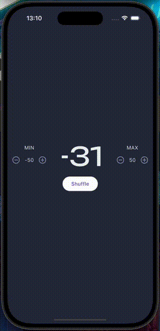

<p align="center">
  
</p>

### (in app animation is as smooth as devices fps the reduced quality and framerate in 
### this demo is limited by .gif format)
# Roll Dice App

The Roll Dice App is a simple Flutter application that allows users to roll a virtual dice. This app is designed to demonstrate the basic functionalities of Flutter, including state management, UI design, and random number generation.

## Features

- Roll a virtual dice with a single tap.
- Display the result of the dice roll.
- Simple and intuitive user interface.

## Getting Started

To get started with the Roll Dice App, follow these steps:

1. Clone the repository:
    ```bash
    git clone https://github.com/yourusername/roll_dice.git
    ```
2. Navigate to the project directory:
    ```bash
    cd roll_dice
    ```
3. Install the dependencies:
    ```bash
    flutter pub get
    ```
4. Run the app:
    ```bash
    flutter run
    ```

## Requirements

- Flutter SDK
- Dart SDK


